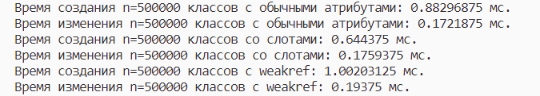
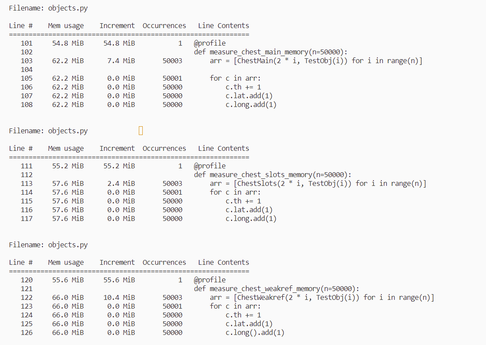
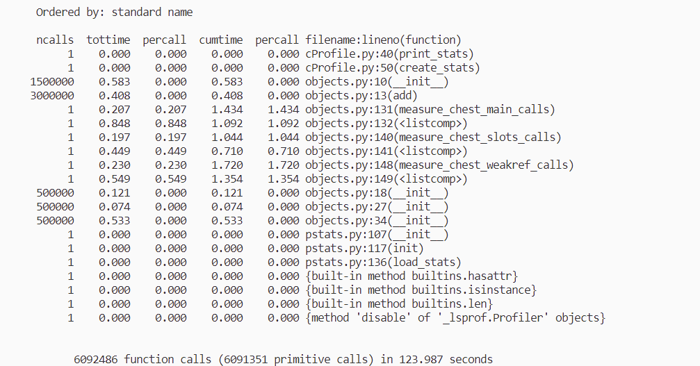

В результате замеров, выяснилось, что время создания классов со слотами меньше, чем время создания обычных классов в 1.4 раза, при этом время создания обычных классов меньше времени создания классов с weakref в 1.1 раза.

Время изменения атрибутов в классе со слотами и обычными атрибутами практически идентично, при этом время изменения атрибутов, для класса с weakref больше в 1.1 раза, чем время изменения атрибутов обычного класса.

Время создания классов со слотами меньше остальных, поскольку в этом случае не создается словарь атрибутов \__dict__.

При этом время создания классов с weakref и изменения их атрибутов больше, чем время создания и обращения к атрибутом обычных классов, поскольку использование weakref приводит к созданию нового, промежуточного объекта.  

Создание 50000 классов с обычными атрибутами требует 7.4 МБ памяти, со слотами - 2.4 МБ, с weakref - 10.4 МБ.

Использование классов со слотами требует меньше всего памяти, по причине отсутствия в классе словаря. 

Поскольку weakref создает новый объект, то данный класс требует больше памяти, чем класс с обычными атрибутами, но при этом использование слабых ссылок позволяет питону эффективней очищать память, например когда ссылка на объект требуется лишь для контроля и не должна осуществлять владение тяжелым объектом.

